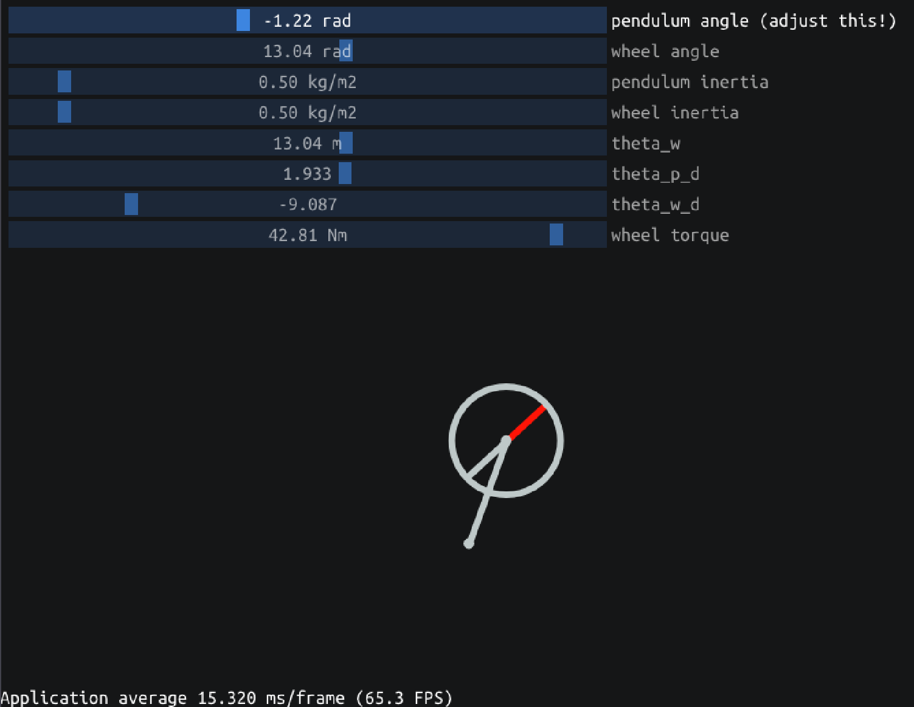
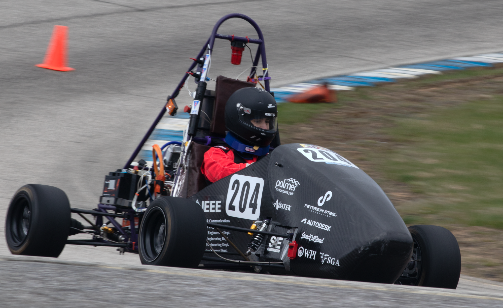
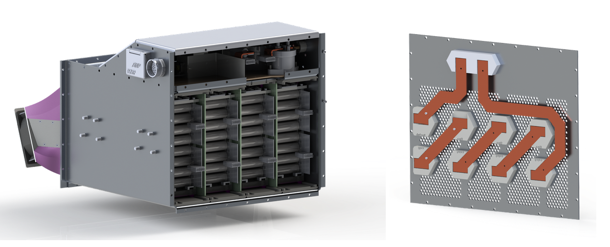
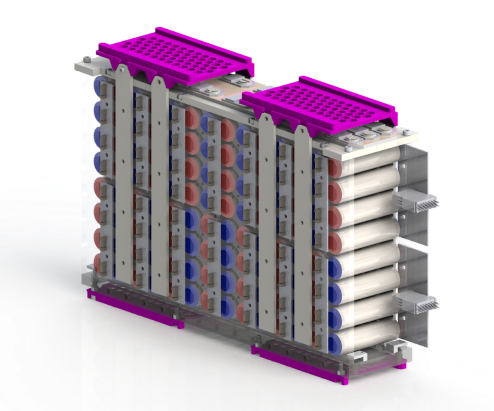
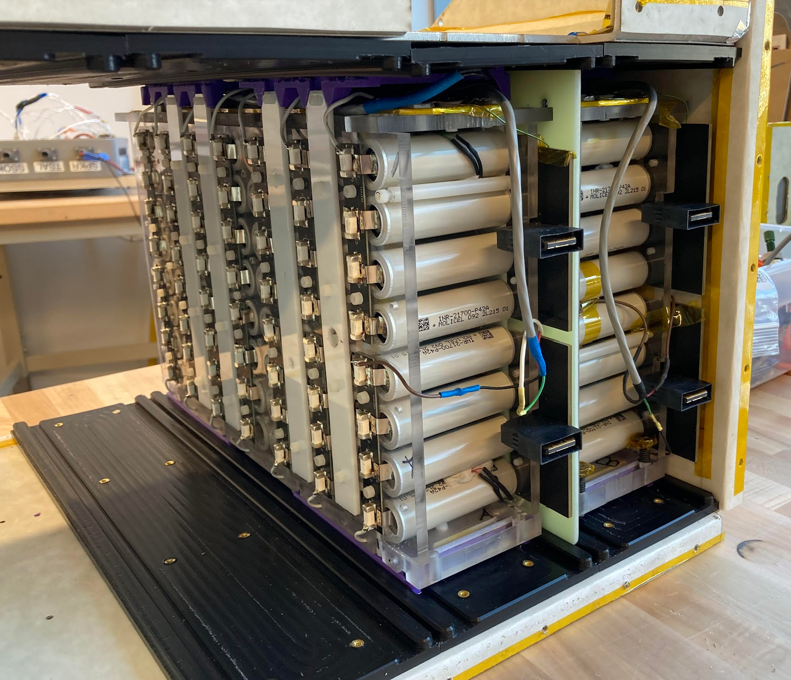
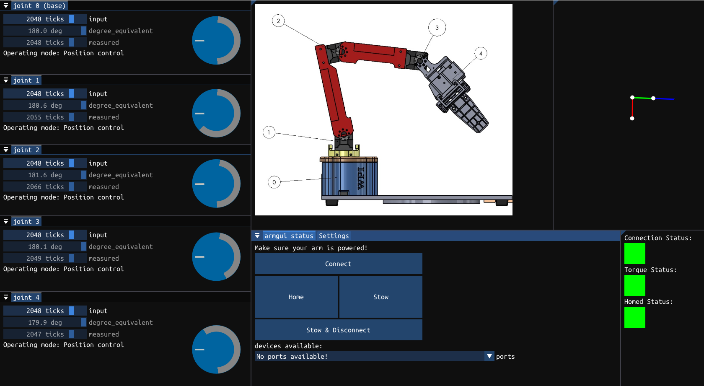

# Projects

## Reaction Wheel Simulation

[Go to simulation!](https://petermurray.net/?page=irwp)

&ensp; Play around with this inverted reaction wheel pendulum, created with <a href="https://github.com/ocornut/imgui">Dear Imgui</a>, compiled to WebAssembly using Emscripten. This simulation is unrealistic but very fun to play with.

10/2024
## Electric Racecar

&ensp; EV23 is WPI's electric racecar that raced at the 2023 Formula Hybrid + Electric competition, and <a href="https://www.formula-hybrid.org/history/2023">tied for third overall</a>. I worked with some incredibly talented engineers, and was a member of battery subteam.

### Redesigned accumulator & servicable segment rails

  
  

[see more](https://petermurray.net/?page=fsae)

2022-23 school year
## Motion Planning Animations

[see more](https://petermurray.net/?page=rrt)

&ensp; Taking inspiration from 3B1B's <i>Manim</i>- more specifically, <a href="https://www.manim.community/">Manim Community</a>- I created a series of videos that go over the basics of the rapidly exploring random tree, an interesting and fundamental motion planning concept that lacked any beautiful visual representation.  

2023-24 school year
## Armgui

[see more](https://petermurray.net/?page=armgui)

&ensp; Armgui is a standalone desktop application built to both test and create an easier way to get familiar with the [OpenManipulatorX](https://emanual.robotis.com/docs/en/platform/openmanipulator_x/overview/), a small scale robotic arm.

7/2024